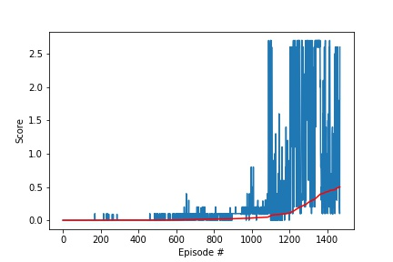

# Tennis - Collaboration and Competition¶

This notebook contains the solution of the third project of the [Deep Reinforcement Learning Nanodegree](https://www.udacity.com/course/deep-reinforcement-learning-nanodegree--nd893).

---

## The Environment

It uses the Tennis environment from [Unity Technologies](https://github.com/Unity-Technologies/ml-agents/blob/master/docs/Learning-Environment-Examples.md#tennis) environment.


In this environment, two agents control rackets to bounce a ball over a net. If an agent hits the ball over the net, it receives a reward of `+0.1`. If an agent lets a ball hit the ground or hits the ball out of bounds, it receives a reward of `-0.01`. Thus, the goal of each agent is to keep the ball in play.

The task is episodic, and in order to solve the environment, your agents must get an average score of `+0.5` (over `100` consecutive episodes, after taking the maximum over both agents). Specifically,

- After each episode, we add up the rewards that each agent received (without discounting), to get a score for each agent. This yields 2 (potentially different) scores. We then take the maximum of these 2 scores.
- This yields a single **score** for each episode.

The environment is considered solved, when the average (over 100 episodes) of those **scores** is at least `+0.5`.

Please note, that the files `maddpg.py` as well as `model.py` are needed.

### State and Action Spaces

The observation space consists of `8` variables corresponding to the position and velocity of the ball and racket. Each agent receives its own, local observation.

Two continuous actions are available, corresponding to movement toward (or away from) the net, and jumping.

## MADDPG - Agent

[Deep Deterministic Policy Gradient](https://arxiv.org/pdf/1509.02971.pdf) is a Actor-Critic based algorithm.  
It is model-free and has a off-policy approach.
It is combining approaches from `DQN` (see the previous project) and `DPG`, extending `DQN`'s discrete space ability to also work in continuous space, applying a deterministic policy.

The Actor and Critic are represented by two neural networks.  
Former approximates the optimal policy in an argmax Q(s, a) fashion without learning the probability distribution of the actions first, unlike the pure value-based approaches.
The latter uses the actions provided by the actor to approximate the optimal action-value for each state.

The `MA` is simply a multi-agent version of `DDPG`.

### Visualization


### Pseudocode


### Integrated Extensions

#### Replay Buffer

A replay buffer is a stack of (s1, a1, r1, s2) experiences.  
DDPG, being a off-policy approach - the action policy is not the policy which is improved, it is possible to increase the sample-efficiency by storing past transitions.  
These past transitions are being sampled resulting in a uncorrelated relationship to the originally obtained experience sequence. This also ensures the general assumption that samples are independently and identically distributed.

#### Target Updates

In order to have a stable evaluation, being not dependent on current instabil improvement steps, two neural networks are deployed for each, actor and critic.
The target networks weights are much slower updated, resulting in a more stable evaluation.

#### Exploration Noise

In order to deploy exploration in continuous action space the Ornstein-Uhlenbeck noise is being applied.

### Implemention

The environment is based on [Unity ML Agent's Tennis](https://github.com/Unity-Technologies/ml-agents/blob/main/docs/Learning-Environment-Examples.md) and was modified by Udacity.

The [Tennis.ipynb](Tennis.ipynb) uses the headless environment and the [MADDPG Agent](maddpg.py), which in turn is depending on the [model.py](model.py).

Notable external dependencies is the [PyTorch libary](https://pytorch.org/).



The convergence plot shows that the agent achieves a target max score of 0.5 consistently at around 1400 episodes.

Notable parameters are:

```python

# MADDPG training
n_episodes=4000         # number of episodes to train
max_t=1000              # max steps per trajectory
score_target=0.5        # if the avg score of the last 100 episodes is above this threshold, terminate
print_every=100         # log episode and avg. score every x episodes

# MADDPG agents
BUFFER_SIZE = int(1e6)  # replay buffer size
BATCH_SIZE = 128        # minibatch size
GAMMA = 0.99            # discount factor
TAU = 1e-3              # for soft update of target parameters
LR_ACTOR = 1e-3         # learning rate of the actor
LR_CRITIC = 1e-3        # learning rate of the critic
WEIGHT_DECAY = 0        # L2 weight decay

EPSILON = 1.0           # value for epsilon in noise decay process
EPSILON_DECAY = 1e-6    # epsilon decay

# Models
# Actor
fc1_units=128           # number of neutrons in feed forward layer
fc2_units=128           # number of neutrons in feed forward layer
# Critic
fc1_units=128           # number of neutrons in feed forward layer
fc2_units=128           # number of neutrons in feed forward layer
```

So the network architecture has 2 layers with 128 nodes.

A [ReLU](<https://en.wikipedia.org/wiki/Rectifier_(neural_networks)>) activation functions for both layers.  
And a Batch normalization function between the first and second layer.

Those architectures are deployed with a local and target network for both, actor and critic - please refer to [maddpg.py](maddpg.py) and [model.py](model.py) for the specific implemenation.

### Future work

- Run a grid search to optimize hyperparameters
- Try the MADDPG implementation on the soccer task
- Implement different shared communications between the actors and critics of the multi-agents as suggested by the [MADDPG paper](https://arxiv.org/abs/1706.02275v4)
