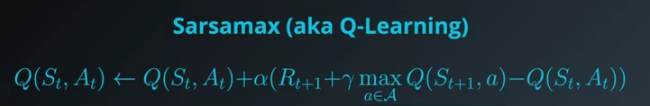
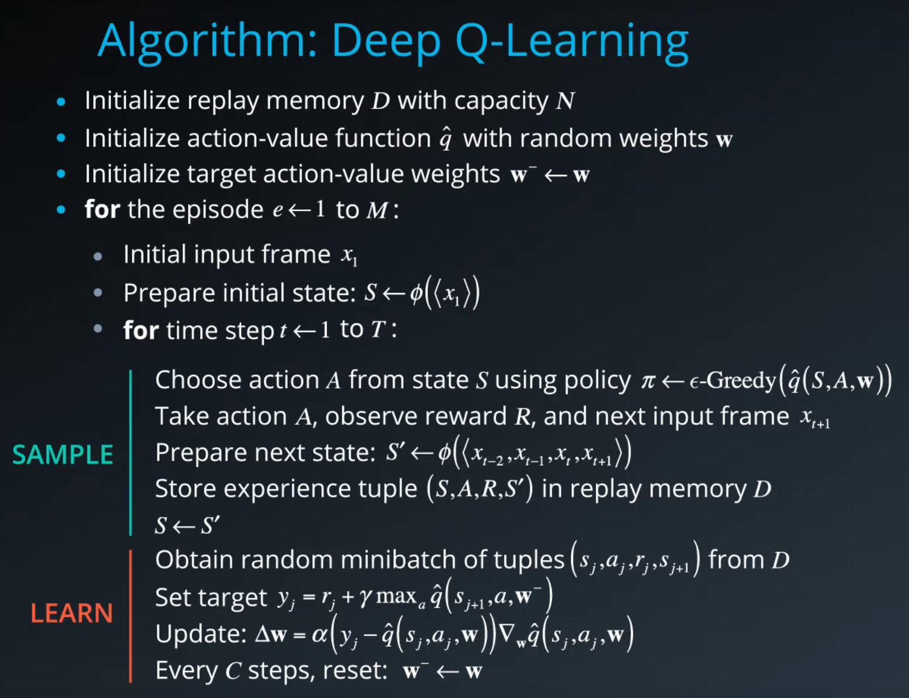
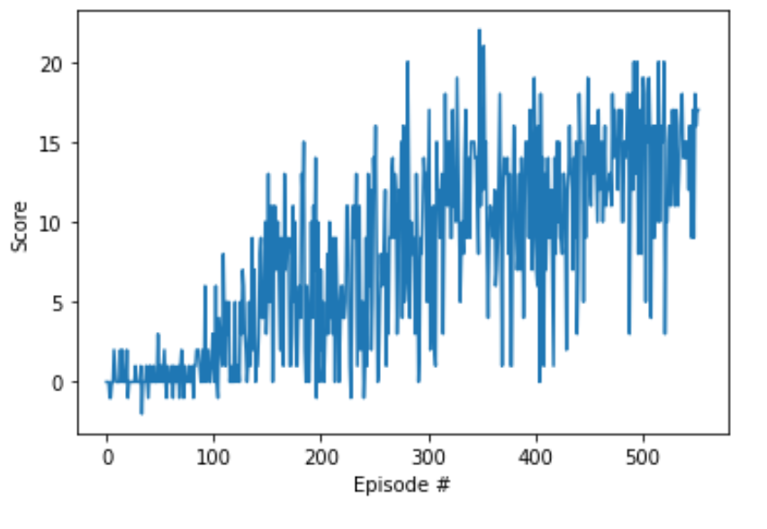

# Banana Collecting Agent

This notebook contains the solution of the first project of the [Deep Reinforcement Learning Nanodegree](https://www.udacity.com/course/deep-reinforcement-learning-nanodegree--nd893).

### The Environment

It uses the Banana environment from [Unity Technologies](https://github.com/Unity-Technologies/ml-agents/blob/main/docs/Learning-Environment-Examples.md#banana-collector).


The goal for the agent is to navigate through the environment and collect yellow bananas and avoiding blue bananas.

The task is episodic and in order to solve the environment, the agent must get an average score of `+13` over `100` consecutive episodes.

Please note, that the files `dqn_agent.py` as well as `model.py` are needed.

### State and Action Spaces

The simulation contains a single agent that navigates a large environment. At each time step, it has four actions at its disposal:

- `0` - walk forward
- `1` - walk backward
- `2` - turn left
- `3` - turn right

The state space has `37` dimensions and contains the agent's velocity, along with ray-based perception of objects around agent's forward direction.  
A reward of `+1` is provided for collecting a yellow banana, and a reward of `-1` is provided for collecting a blue banana.

### DQN - Agent

Deep Q-Network-agents are value based models, meaning they maintain a state-value function.  
They combine the [SARSA max](http://citeseerx.ist.psu.edu/viewdoc/download?doi=10.1.1.80.7501&rep=rep1&type=pdf) algorithm as well as a neural network approximating the state-action value - which would otherwise be the Q-table.

They are based on [research of DeepMind](https://deepmind.com/research/publications/human-level-control-through-deep-reinforcement-learning).



This implementation also addresses improvements, that is Experience Replay and Fixed Q-Targets.  
See the [original paper](https://storage.googleapis.com/deepmind-media/dqn/DQNNaturePaper.pdf)



### Implementation

The environment is based on [Unity ML Agent's Banana Collector](https://github.com/Unity-Technologies/ml-agents/blob/main/docs/Learning-Environment-Examples.md) and was modified by Udacity.

The [Navigation_own.ipynb](Navigation_own.ipynb) uses the headless environment and the [DQN Agent](dqn_agent.py), which in turn is depending on the [Q-Network](model.py).

Notable external dependencies is the [PyTorch libary](https://pytorch.org/).



The convergence plot shows that the agent achieves a target score of 13 consistently between 300 and 400 episodes.

Notable parameters are:

```python

# DQN training
n_episodes=2000         # number of episodes to train
eps_start=1.0           # exploration vs. exploration factor
eps_end=0.01            # minimal exploration threshold
eps_decay=0.995         # exploration decay per episode

# DQN agent
BUFFER_SIZE = int(1e5)  # replay buffer size
BATCH_SIZE = 64         # minibatch size
GAMMA = 0.99            # discount factor
TAU = 1e-3              # for soft update of target parameters
LR = 5e-4               # learning rate
UPDATE_EVERY = 4        # how often to update the network

# Q-Network
fc1_units=64            # number of neutrons in feed forward layer
fc2_units=64            # number of neutrons in feed forward layer
```

[ReLU](<https://en.wikipedia.org/wiki/Rectifier_(neural_networks)>) activation functions for both layers.

### Future work

[The Rainbow algorithm](https://arxiv.org/abs/1710.02298) combines several improvements to the original paper and outperforms individual modifications of the algorithm.  
For the present problem at hand, I expect this implementation to achieve the required score faster and having more stable results in inference.

Regarding the pixel version of the environment, a [convolution neural network](https://en.wikipedia.org/wiki/Convolutional_neural_network) could convert pixels to spatial meaningful data which could be further processed by the rainbow algorithm instead of just using a [feed forward network](https://en.wikipedia.org/wiki/Feedforward_neural_network) which is implemented as of now.
